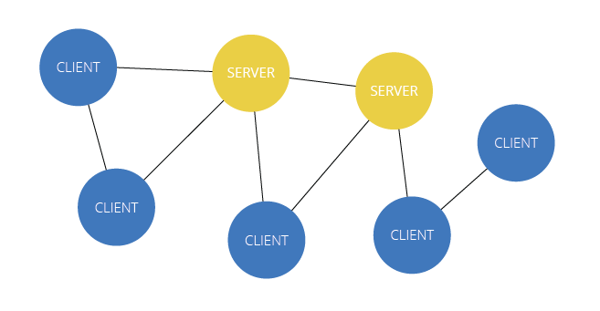

## Introduction

### Web architecture (client/server)
When you are visiting web sites, you do so using your web browser. Talking about web architecture, we often talk about the client and the server, and subsequently the client-server architecture. In that an architecture your browser is the client, and the server that provides the files you see is the server.

Note that your browser is not your only connection to the Internet, as there are other ways of sharing files than using the HTTP protocol.

#### Client
Once connected, the user can access the web trough software, called browsers (e.g. Firefox, Chrome, Safari). These browsers can locate and display information from the web.

Communication between the client and the server is done by an agreed transmission language, or protocol, e.g. HyperText Transfer Protocol (HTTP).

The user requests a web page through the browser, which communicates this to the server. The browser then waits for the web page to be delivered, which typically is a file containing HTML. When the file is recieved, the browsers renders the page based on the files received.

#### Server
The server is software running on a computer, responding to requests from the client. The web page and database exists on the server's local file system. The server retrieves and transmits file to the client.

#### Cloud
The cloud is a network of servers for the purpose of sharing resources.

#### Network
Computers, both servers and clients, that are connected together is a network. Each server or client is a node in the network, and their connections can be illustrated using edges between the nodes.

Computers that are close together (within a single department or building) make up a local area network (LAN). A network of computers that covers a wide area, such as several buildings, cities, or even larger areas, is called wide area network (WAN). The largest WAN in existence is the Internet.

### The Internet
The Internet was created by the Advanced Research Project Agency (ARPA) and the U.S. Department of Defence for sientific and military communications, and was called ARPANET. In 1969 it consisted of four network nodes, connected by a phone line.

The Internet is a "network of networks", and is made up of millions of computers, and other hardware, such as smart phones, PDAs, TVs, Blu Ray players, gaming consoles, printers and light bulbs.

The physical structure of the Internet uses fiberoptic cables, satellites, phone lines and other telecommuncations media.

#### TCP/IP
Every computer and network on the Internet uses the same protocols, the Transmission Control Protocol/Internet Protocol, or TCP/IP. No matter what type of computer system you connect to the Internet, if it uses TCP/IP, it can exchange data with any other type of computer. TCP/IP was developed to tolerate unreliable sub-networks and the protocol guarantees proper transmission of data, since the physical network can't.

There are four TCP/IP layers:
* The application layer provides applications the ability to access the service of the other layers and defines the protocols that applications use to exchange data.
* The transport layer is responsible for making sure that complete messages are delivered end to end.
* The network/Internet layer is responsible for routing messages from one place to another. All routers on the Internet run the IP protocol.
* The bottom layer is the Physical Layer. This is responsible for actually translating the software message into a physical representation and putting them on the wire (or through the air in a wireless network or fiberoptic wire).

There are many different protocols at each lever, here are some representative protocols for the Internet:

|Layer|Protocls|
|---|---|
|Application layer|HTTP, telnet, ftp, email, VoIP|
|Transport Layer|TCP, UDP|
|Network Layer|IP|
|Physical Layer|Ethernet, WiFi, ATM, X.25, Frame Relay|

#### Domains and DNS
In addition to an IP address, most Internet hosts, or servers, have a domain name address. A domain name identifies the type of institution that owns the computer. E.g. an Internet server owned by NTNU might have the domain name ntnu.no. The domain name is itself made up of name levels so that .no is Norway, and ntnu is NTNU's web site. Some enterprises have multiple servers, and identify them with subdomains, such as idi.ntnu.no.

|Top level domain|Definition|For use by|
|---|---|---|
|.com|Commercial|Businesses|
|.edu|Education|Universities|
|.gov|Governments|U.S. Federal government agencies|
|.int|International|Organizations established by international treaties|
|.no|Norway|Norwegian organizations|
|.mil|Military|U.S. military|
|.io|British Indian Ocean Territory|British Indian Ocean Territory organizations and webhipsters|
|.net|Network|Network providers, administrator computers, network node computers|
|.org|Organization|Non-profit and miscellaneous organizations|

As far as the Internet is concerned, the symbolic machine names are "eye candy" for human consumption. IP addresses are necessary for computers communication. The IP addresses are provided by Domain Name Server (DNS) computer's "phone lists" that map symbolic names (ntnu.no) to their IP. DNS machines are responsible for providing the IP mapping and for the upkeep of the database as new machines and IPs are added to the Internet.

DNS exists so that you don't have to remember the IP address, only the domain name (which is easier for us humans to remember). When you write a domain name in your address bar, your computer contacts a DNS server which returns the IP address to your computer. Then the computer accesses the server with that IP address.

#### Routing
When a computer connects to the Internet, it is connected to a smaller network that is connected to the Internet's backbone, the tier 1 networks. Your request then travels trough, potentially, several networks before reaching it's destination.  When you use the Internet, your client requests data from a host system. The request and data are broken into packets and travel across multiple networks before being reassembled at their destination.

For robust networks, a transmission protocol must find new routes to a destination as preferred routes don't work very well. This is achieved by dynamic routing, where the routes are selected at the time of transmission, after considering current network conditions. Dynamic routing requires a network architecture devoid of critical sites, whose failure will bring down the entire network. That is, the network cannot be hierarchical.

The Internet was designed on a lattice or graph, where there are a large number of widely distributed paths. The hosts performing routing duties are called routers, of which there are thousands on the Internet.

#### World Wide Web
Many users confuse the Internet with applications that work over the Internet. There are many such applications, but the five listed below are amongst the most popular:
* Email
* Telnet
* File Transfer Protocol (ftp)
* Internet Relay Chat (IRC)
* The World Wide Web

Timothy Berners-Lee, and other researchers, at CERN nuclear research facility near Geneva, Switzerland laid the foundation for the World Wide Web in 1989. They developed a system of interconnected hypertext documents that allowed their users to easily navigate from one topic to another. Hypertext is a method of organizing information that gives the reader control over the order in which the information is presented.

The key to hypertext is the use of hyperlinks (or links) which are the elements in a hypertext document that allows you to jump from one topic to another. A link may point to another section of the same document, or to another document entirely. A link can open a document on your computer, or through the Internet on a computer anywhere in the world. An entire collection of linked documents is referred to as a web site. The hypertext documents within a web site are known as web pages. Individual pages can contain text, audio, video, and even programs that can be run remotely.
