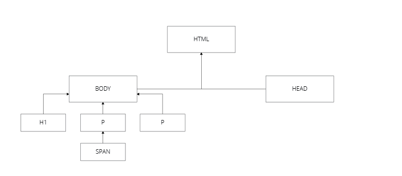

## Document Object Model
The Document Object Model (DOM) is a programming interface for HTML and XML document. It provides a structured representation of the document, and defines a way to access the objects from programs or scripts so that they can change the document structure, style and content.

The DOM provides a representation of the document as a structured group of nodes and objects that have properties and methods. In short, the DOM connects web pages to scripts (such as JavaScript) or other programming languages.

A web page is a document. It can either be displayed in the browser window, or as the HTML source. Bot being the same document. It can also be viewed as a document tree, consisting of nodes and objects. This HTML file:

```html
<html>
  <head>
    ...
  </head>
  <body>
    <h1>Title</h1>
    <p>
      Some <a>linked</a> text.
    </p>
    <p>
      And some unlinked text.
    </p>
  </body>
</html>
```

... would give this document tree:



In chapter 13 you will learn how to manipulate the DOM. This chapter is meant as an short introduction to the DOM concept, and make you think about the HTML document as a tree structure. The content in this chapter is gathered from [MDN](https://developer.mozilla.org/en-US/docs/Web/API/Document_Object_Model/Introduction), there you can read more about DOM.
